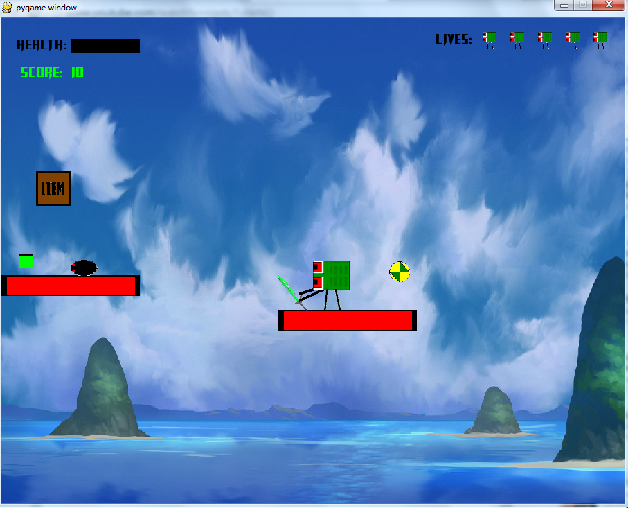

# Sylvesters-Journey
First ever game, from back in grade 11. I might add a few things to it but mainly I
put this up just so others can enjoy it if they like, and so I know where it is.

#### NEW - Vertical Motion
Use this branch if you would like to try out the new vertical motion, in which when
the character jumps, he moves, not the surrounding level. The level then centers itself around
the character when he lands. And the level will be the one to move around the character if the
character gets too high or low, so as to keep the character from falling off the screen.

### To Play
Just clone the repo in, navigate to it, and `python runGame.py`. Hitting
Ctrl+F toggles fullscreen mode. The rest of the instructions should be in the
game and the menus.

Also make sure you have pygame by doing `pip install pygame`. This is for
Python 2.7 as well.

## Have fun!

